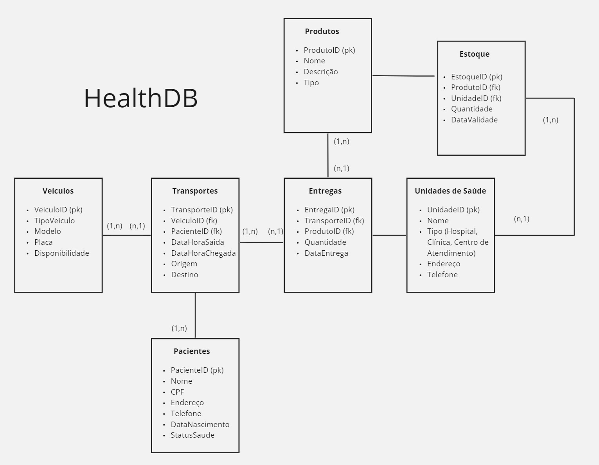
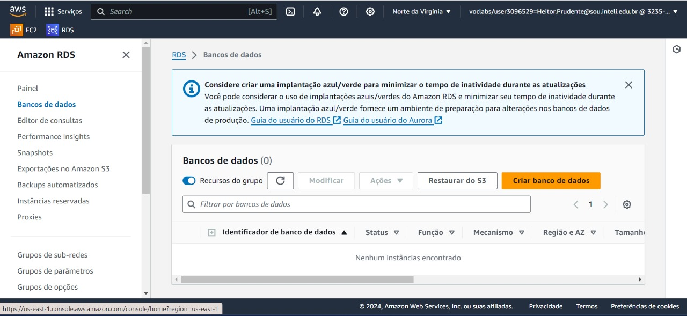
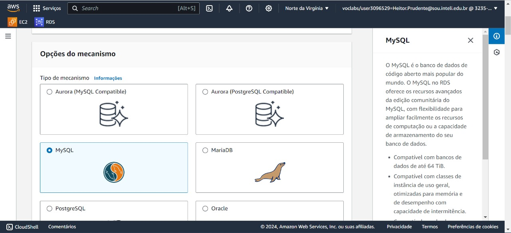
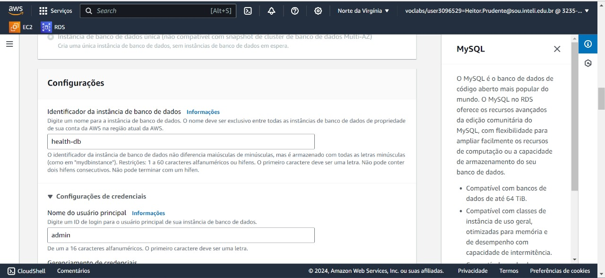
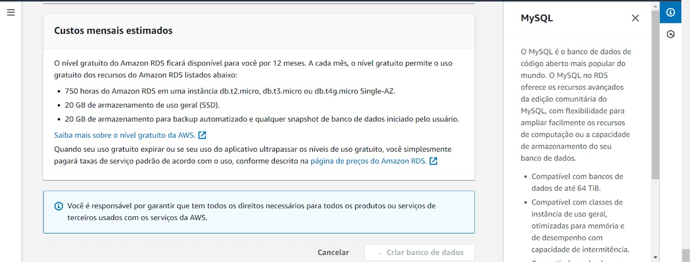
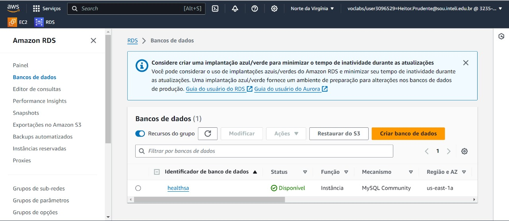
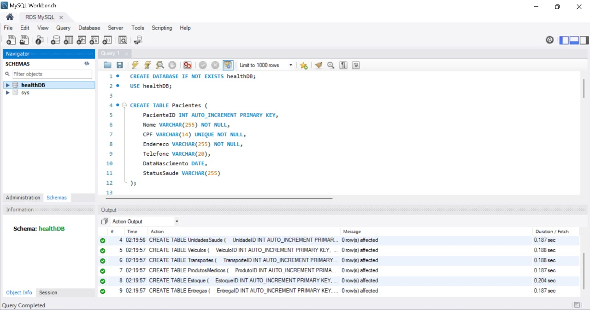

# Documentação do Projeto HealthDB

## 📘 Introdução

&emsp;&emsp;Este documento detalha a configuração e operação do banco de dados `HealthDB`, criado no RDS da AWS para a gestão integrada de serviços de transporte e logística de produtos médicos no setor de saúde. O documento visa apresentar as etapas realizadas e os resultados obtidos para avaliação técnica.

## 🖋️ Criação do Modelo Lógico

&emsp;&emsp;Antes de iniciar a implementação física do banco de dados, foi desenvolvido um modelo lógico para estruturar e organizar as informações que o `HealthDB` deve gerenciar. Este modelo define as tabelas, seus atributos e as relações entre elas, garantindo que o banco de dados seja capaz de suportar eficientemente as operações necessárias para o transporte de pacientes e a logística de produtos médicos.

### Modelo Lógico

&emsp;&emsp;O diagrama do modelo lógico abaixo ilustra a estrutura e as relações entre as entidades do banco de dados `HealthDB`.

<div align="center">
  <sub>Figura 1 - Modelo Lógico do Bando de Dados</sub>
  
  <sup>Fonte: O autor (2024)</sup>
</div>

## 🛠️ Configuração do Banco de Dados no AWS RDS

### Passo 1: Criar Instância de Banco de Dados

1. **Acesso ao Amazon RDS**: Acessar o painel de gerenciamento do Amazon RDS e iniciar o processo de criação de uma nova instância de banco de dados.
  <div align="center">
  <sub>Figura 2 - Painel AWS</sub>
  
  <sup>Fonte: O autor (2024)</sup>
</div>

2. **Seleção do MySQL como Motor de Banco de Dados**: Escolher MySQL dentre as opções disponíveis por ser amplamente utilizado e suportado.
  <div align="center">
  <sub>Figura 2 - Selecionar MySQL</sub>
  
  <sup>Fonte: O autor (2024)</sup>
</div>

3. **Definição das Configurações da Instância**: Inserir as configurações necessárias como identificador da instância (`health-db`) e credenciais do usuário (`admin`).
   <div align="center">
  <sub>Figura 3 - Configurações</sub>
  
  <sup>Fonte: O autor (2024)</sup>
</div>

4. **Revisão e Criação da Instância**: Revisar os custos estimados e finalizar a criação da instância.
   <div align="center">
  <sub>Figura 4 - Revisão</sub>
  
  <sup>Fonte: O autor (2024)</sup>
</div>

5. **Confirmação de Criação**: Confirmar que a instância está disponível para uso.
   <div align="center">
  <sub>Figura 5 - Confirmação</sub>
  
  <sup>Fonte: O autor (2024)</sup>
</div>

### Passo 2: Conexão via MySQL Workbench

- **Conexão e Criação de Tabelas**: Utilizar o MySQL Workbench para conectar à instância RDS e executar os scripts SQL para a criação das tabelas.
   <div align="center">
  <sub>Figura 6 - Criar tabelas</sub>
  
  <sup>Fonte: O autor (2024)</sup>
</div>

- **Inserção de dados simulados**: Inserir no `HealthDB` dados genéricos que preencham todas as tabelas.
     <div align="center">
  <sub>Figura 7 - Dados inseridos na tabela Entregas </sub>
  
  <sup>Fonte: O autor (2024)</sup>
</div>

- **Cálculo do número médio de pacientes transportados por veículo por mês**: Exemplo de número médio de pacientes trasnsportados pelo veículo 1 no mês 1.
     <div align="center">
  <sub>Figura 8 - Cálculo médio </sub>
  
  <sup>Fonte: O autor (2024)</sup>
</div>

## 📝 Scripts SQL Utilizados

### Criação das tabelas
```
CREATE DATABASE IF NOT EXISTS healthDB;
USE healthDB;

CREATE TABLE Pacientes (
    PacienteID INT AUTO_INCREMENT PRIMARY KEY,
    Nome VARCHAR(255) NOT NULL,
    CPF VARCHAR(14) UNIQUE NOT NULL,
    Endereco VARCHAR(255) NOT NULL,
    Telefone VARCHAR(20),
    DataNascimento DATE,
    StatusSaude VARCHAR(255)
);

CREATE TABLE UnidadesSaude (
    UnidadeID INT AUTO_INCREMENT PRIMARY KEY,
    Nome VARCHAR(255) NOT NULL,
    Tipo ENUM('Hospital', 'Clinica', 'Centro de Atendimento') NOT NULL,
    Endereco VARCHAR(255) NOT NULL,
    Telefone VARCHAR(20)
);

CREATE TABLE Veiculos (
    VeiculoID INT AUTO_INCREMENT PRIMARY KEY,
    TipoVeiculo ENUM('Ambulancia', 'Van', 'Caminhao de Suprimentos') NOT NULL,
    Modelo VARCHAR(255) NOT NULL,
    Placa VARCHAR(10) UNIQUE NOT NULL,
    Disponibilidade BOOLEAN NOT NULL
);

CREATE TABLE Transportes (
    TransporteID INT AUTO_INCREMENT PRIMARY KEY,
    VeiculoID INT NOT NULL,
    PacienteID INT,
    DataHoraSaida DATETIME NOT NULL,
    DataHoraChegada DATETIME NOT NULL,
    Origem VARCHAR(255) NOT NULL,
    Destino VARCHAR(255) NOT NULL,
    Finalidade ENUM('Transporte de Paciente', 'Entrega de Suprimentos') NOT NULL,
    FOREIGN KEY (VeiculoID) REFERENCES Veiculos(VeiculoID),
    FOREIGN KEY (PacienteID) REFERENCES Pacientes(PacienteID)
);

CREATE TABLE ProdutosMedicos (
    ProdutoID INT AUTO_INCREMENT PRIMARY KEY,
    Nome VARCHAR(255) NOT NULL,
    Descricao TEXT,
    Tipo ENUM('Medicamento', 'Equipamento', 'Suprimento') NOT NULL
);

CREATE TABLE Estoque (
    EstoqueID INT AUTO_INCREMENT PRIMARY KEY,
    ProdutoID INT NOT NULL,
    UnidadeID INT NOT NULL,
    Quantidade INT NOT NULL,
    DataValidade DATE NOT NULL,
    FOREIGN KEY (ProdutoID) REFERENCES ProdutosMedicos(ProdutoID),
    FOREIGN KEY (UnidadeID) REFERENCES UnidadesSaude(UnidadeID)
);

CREATE TABLE Entregas (
    EntregaID INT AUTO_INCREMENT PRIMARY KEY,
    TransporteID INT NOT NULL,
    ProdutoID INT NOT NULL,
    Quantidade INT NOT NULL,
    DataEntrega DATE NOT NULL,
    FOREIGN KEY (TransporteID) REFERENCES Transportes(TransporteID),
    FOREIGN KEY (ProdutoID) REFERENCES ProdutosMedicos(ProdutoID)
);
```

### Inserção dos Dados
```
-- Inserindo Pacientes
INSERT INTO Pacientes (Nome, CPF, Endereco, Telefone, DataNascimento, StatusSaude)
VALUES ('Maria Silva', '123.456.789-00', 'Rua das Flores 100, São Paulo', '11987654321', '1980-04-25', 'Saudável'),
       ('João Santos', '987.654.321-00', 'Av. Brasil 200, Rio de Janeiro', '21987654321', '1990-06-15', 'Diabetes tipo 2');

-- Inserindo Unidades de Saúde
INSERT INTO UnidadesSaude (Nome, Tipo, Endereco, Telefone)
VALUES ('Hospital Central', 'Hospital', 'Av. Central 1234, São Paulo', '1123456789'),
       ('Clinica Vida', 'Clinica', 'Rua Esperança 987, Rio de Janeiro', '2123456789');

-- Inserindo Veículos
INSERT INTO Veiculos (TipoVeiculo, Modelo, Placa, Disponibilidade)
VALUES ('Ambulancia', 'Mercedes Sprinter', 'XYZ-1234', TRUE),
       ('Caminhao de Suprimentos', 'Volvo FH12', 'ABC-9876', TRUE);

-- Inserindo Transportes
INSERT INTO Transportes (VeiculoID, PacienteID, DataHoraSaida, DataHoraChegada, Origem, Destino, Finalidade)
VALUES (1, 1, '2023-01-01 08:00:00', '2023-01-01 09:00:00', 'Rua das Flores 100, São Paulo', 'Av. Central 1234, São Paulo', 'Transporte de Paciente'),
       (2, NULL, '2023-01-02 08:00:00', '2023-01-02 12:00:00', 'Depósito Central, São Paulo', 'Hospital Central, São Paulo', 'Entrega de Suprimentos');

-- Inserindo Produtos Médicos
INSERT INTO ProdutosMedicos (Nome, Descricao, Tipo)
VALUES ('Paracetamol 500mg', 'Medicamento para dor e febre', 'Medicamento'),
       ('Kit de sutura', 'Kit com material para sutura', 'Suprimento');

-- Inserindo Estoque
INSERT INTO Estoque (ProdutoID, UnidadeID, Quantidade, DataValidade)
VALUES (1, 1, 100, '2024-12-31'),
       (2, 1, 50, '2025-06-30');

-- Inserindo Entregas
INSERT INTO Entregas (TransporteID, ProdutoID, Quantidade, DataEntrega)
VALUES (2, 1, 20, '2023-01-02'),
       (2, 2, 10, '2023-01-02');
```

### Cálculo número médio
```
SELECT
    YEAR(DataHoraSaida) AS Ano,
    MONTH(DataHoraSaida) AS Mes,
    VeiculoID,
    COUNT(DISTINCT PacienteID) AS TotalPacientes,
    COUNT(DISTINCT DATE_FORMAT(DataHoraSaida, '%Y-%m')) AS Meses,
    COUNT(DISTINCT PacienteID) / COUNT(DISTINCT DATE_FORMAT(DataHoraSaida, '%Y-%m')) AS MediaPacientesPorMes
FROM
    Transportes
WHERE
    PacienteID IS NOT NULL
GROUP BY
    VeiculoID,
    YEAR(DataHoraSaida),
    MONTH(DataHoraSaida)
ORDER BY
    VeiculoID, Ano, Mes;
```

## 📊 Conclusão
&emsp;&emsp;Este documento fornece uma visão completa das configurações e operações realizadas no HealthDB. Através do uso do Amazon RDS e MySQL Workbench, foi possível estabelecer uma solução robusta para a gestão de serviços de saúde relacionados ao transporte e entrega de produtos médicos.
